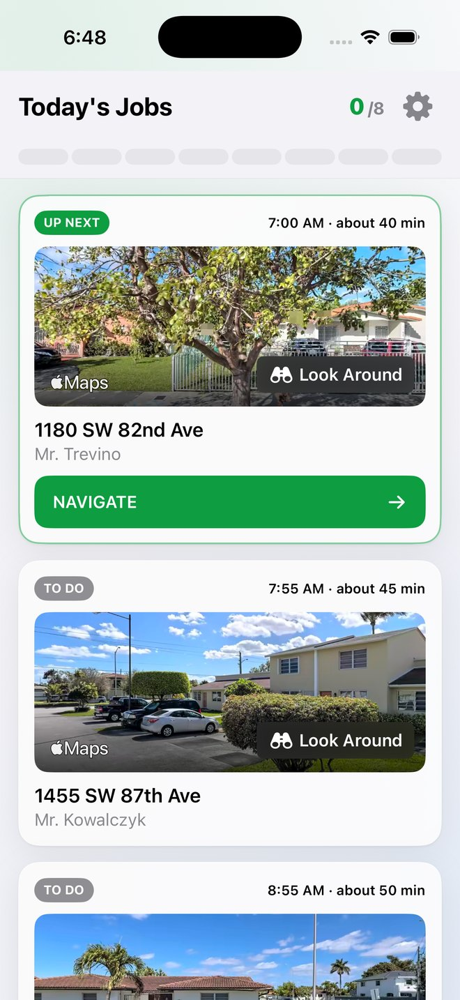
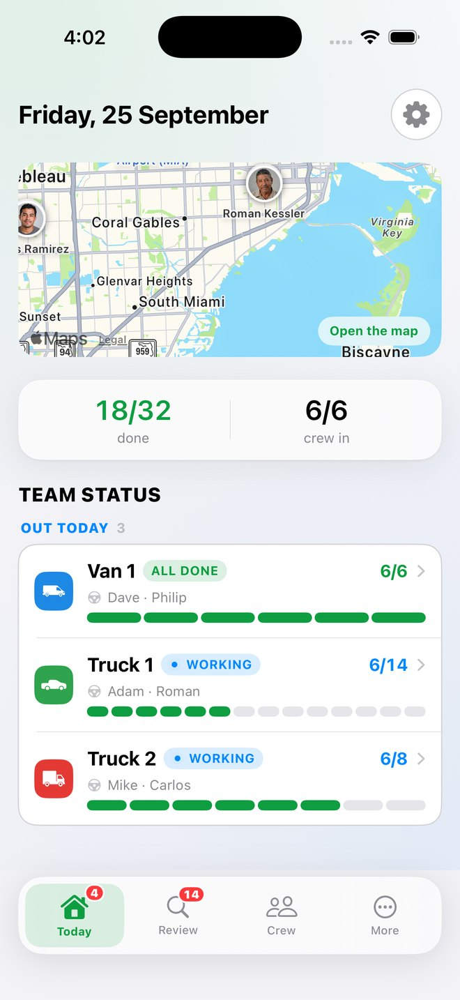
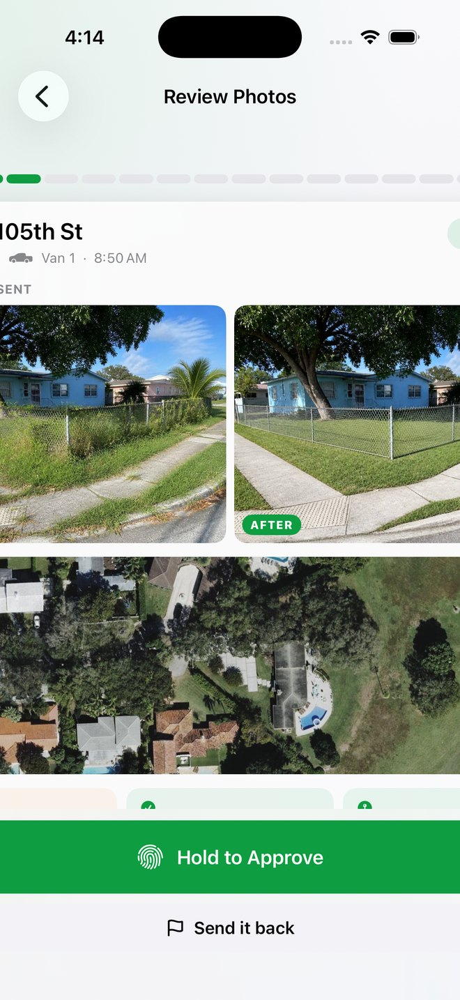
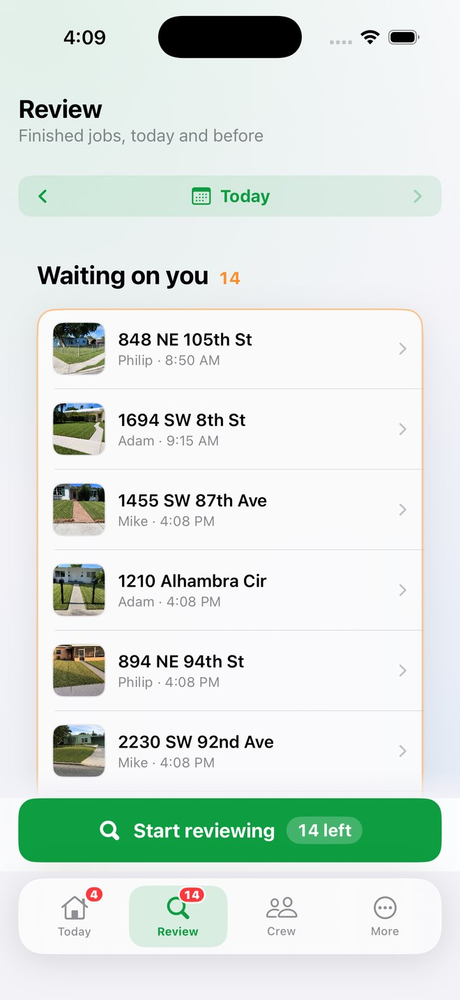

# GroundCrew

**Route, checklist and proof for a landscaping crew. iOS and web.**

Built for an owner of two to twelve people who is on a truck, not at a desk.

---

## The problem

A day ends and the owner does not know whether it ended. The route was in somebody's
head, the checklist was a shout across a yard, and three weeks later a customer says
nobody came and there is nothing to show them.

## What it does

**Orders the route.** Stops sequenced before the truck leaves, not worked out at each
driveway.

**Holds the checklist per property.** What this specific yard needs, on the phone of
the person standing in it.

**Will not close a job without two photographs.** Before and after, from the same spot.
That pair is the whole product. One picture of a tidy lawn proves a lawn is tidy. Two
pictures from the same spot prove somebody did the work.

**Releases the invoice the same day.** The proof is collected at the property, so the
invoice does not wait on anyone's memory.

## Built with

`Swift` `SwiftUI` `Firebase` `Next.js`

## Status

In testing. Source is private.

---

Written and maintained by [Thomas Marmol](https://thomasmarmol.com), who works the
crews it is built for.
